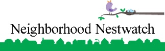

# Neighborhood Nestwatch Technician Data Entry Interface

Hello and welcome to the new interface for entering Neighborhood Nestwatch data! This [**link**](https://smbc.shinyapps.io/appNestwatchTechnicianInterface/)will take you to the web application where you will be submitting all of your field data. Data submitted via interface are saved to files that are stored in a shared Nestwatch Dropbox folder. Before you begin, you need to make sure that your coordinator has given you access to this folder.

***

The web app currently includes six sections:  

**1. Visit:** This section includes important ancillary data to the visit,. The visit section **MUST** be completed as the FIRST step, regardless of which data you are entering or whether you will simply be using the interface to query records. If you visited a site but were unable to encounter any birds, you will still enter data into the visit panel.  
**2. Encounters:** This section includes banding, recapture, and resight data. Remember to **ONLY** complete this section after entering your visit data! You can only submit encounter data for NN species associated with your regional hub. Band only focal species -- if you banded any other species you will have to enter those data elsewhere.  

**3. Query records:** There are many reasons why database queries are essential. For example, technicians need a quick way of obtaining lists of banded birds at a given site in order to know which birds to look for while resighting. Also we need to match the color combination of a resighted bird with that bird’s band number . The band number is absolutely essential to fully update the encounter history of a  the resighted individual. The available options in the table are dependent on the regional hub you entered in the visit section and the default is Atlanta. If you wish to query the table for your hub but do not have visit data to submit, select your hub from the drop-down menu in the visit section but do not submit visit data. The query table will automatically include only records of the hub selected.  

**4. Point counts:** Point count data are entered here visit data!).  

**5. Nest data** (under construction).  

**6. Habitat survey data** (under construction). 

***

The web app includes thorough descriptions of all data entry fields; however, here are a couple of quick pointers prior to moving forward:  

* Enter your visit data first! (Was that stated already?)  

* When entering data into a field, do not try to search through that field’s drop-down menu! Instead, start to type in the box (Note: Fields are not case-sensitive) – the number of options will be reduced as you type.  

* Do not open the files in the Dropbox folder! These folders are for data storage only and should not be accessed otherwise -- If you open these files in Microsoft Excel, Excel will automatically re-format the files using their preferred settings. Saving these files from within Microsoft Excel will cause a great deal of problems. In the near future we will be adding printable encounter history tables to be used when visiting a site and downloadable encounter data.  

***

The goal of our new web app is to make data entry as painless-as-possible while providing the data in a uniform format across all Neswatch regions. Currently we are working on a revised interface for participant data entry which will automatically feed into the entire database. We hope you find the data entry interface easy to use. If you have any difficulties or questions regarding using the web app, please send an email to <reitsmar@si.edu>. As this web app is a work-in-progress, we would also welcome any suggestions on how the app might be improved.  

**Thank you!**

***

